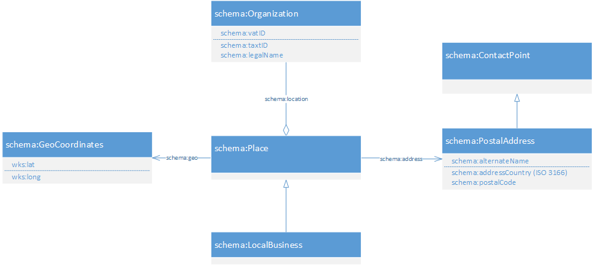

# BOTK\Core
[](http://travis-ci.org/linkeddatacenter/BOTK-core)
[](https://scrutinizer-ci.com/g/linkeddatacenter/BOTK-core)
[](https://packagist.org/packages/botk/core)
[](https://packagist.org/packages/botk/core)
[](https://packagist.org/packages/botk/core)

Super lightweight classes for developing smart gateways to populate a business knowlege base 
compliant with [KEES](http://linkeddata.center/kees) model.

## quickstart

The package is available on [Packagist](https://packagist.org/packages/botk/core).
You can install it using [Composer](http://getcomposer.org).

```bash
composer require botk/core
```

Some code examples in exsamples directory.


## Installation

This package require [composer](http://getcomposer.org/).

Add following dependance to **composer.json** file in your project root:

```
    {
        "require": {
            "botk/core": "~5.0",
        }
    }
```

## Usage

See [examples](examples/RREADME.md) directory.

## BOTK Language profile

The BOTK language profile extends KEES (Knowledge Exchange Engine Schema) with some business related stuff. 
Following vocabularies are partially supported:

| Vocabulary																| Prefix	| Namespace										|
|---------------------------------------------------------------------------|-----------|-----------------------------------------------|
| [rdf](https://www.w3.org/TR/rdf-schema) 									| rdf:		| <http://www.w3.org/1999/02/22-rdf-syntax-ns#> |
| [rdfs](http://www.w3.org/2000/01/rdf-schema) 								| rdfs:		| <http://www.w3.org/2000/01/rdf-schema#>		|
| [owl](http://www.w3.org/2002/07/owl) 										| owl:		| <http://www.w3.org/2002/07/owl#> 				|
| [Dublin Core](http://purl.org/dc/terms/) 									| dct:  	| <http://purl.org/dc/terms/> 					|
| [schema.org](http://schema.org) 											| schema:	| <http://schema.org/>							|
| [WGS 84](http://www.w3.org/2003/01/geo/)									| wgs:  	| <http://www.w3.org/2003/01/geo/wgs84_pos#> 	|
| [FOAF](http://xmlns.com/foaf/spec/)										| foaf:  	| <http://xmlns.com/foaf/0.1/> 					|
| [Data Cube](https://www.w3.org/TR/vocab-data-cube/)						| qb:  		| <http://purl.org/linked-data/cube#> 			|
| [DaQ framework](http://butterbur04.iai.uni-bonn.de/ontologies/daq/daq)	| daq:  	| <http://purl.org/eis/vocab/daq#> 				|
| [BOTK](http://linkeddata.center/botk/)									| foaf:  	| <http://linkeddata.center/botk/v1#> 			|


This picture summarize the main concepts managed:



The primary focus o BOTK are Local Business, defined as a legal organization Business with at least a physical point of sell. 
BOTK vocabulary extend schema.org with some custom resource related to businesses (see [Business Ontology](doc/ontology/README.md))

### String context
No string context should be used.


### https://schema.org/LocalBusiness

Captures  with 
Captures the Business POI (Point Of Interest) concept, that is a a public legal registered business organization  
with a contactable geographic selling point .	
This class can be specialized  to state the reason of the business interest (e.g. see schema:LocalBusiness classifications).


Following properties/annotations supported: 

- rdf:type	with cardinality >= 1 ,  type in the form of prefix:classname at least schema:LocalBusiness must be present
- schema:vatID with cardinality <= 1, as Inverse Functional Property in country context ??
- schema:taxID with cardinality <= 1,
- schema:legalName with cardinality <= 1, as the legal name of the location
- schema:alternateName with cardinality >= 0, contains the insignia of the shop as normalized text
- schema:address  with cardinality <=1 , contact info for this local business  as a schema:PostalAddress individual
- schema:geo with cardinality <= 1 pointer a schema:GeoCoordinates
- schema:telephone with cardinality >= 0, formatted as string with no space, can start with '+', if 00 is present at the beginning,it is substituted with +, as primary telephone contact point for this location
- schema:faxNumber with cardinality >= 0, same formatting of telephone, as primary fax  contact point for this organization
- schema:email with cardinality >= 0,  as  email for a contact point for this organization

Example (in rdf turtle):
```
ex:org1 a schema:LocalBusiness, schema:HealthAndBeautyBusiness ;
	schema:vatID "01209991007" ;
	schema:legalName "ERBORISTERIA \"I PRATI\" DI GIOVANNA MONAMI S.A.S." ;
	schema:alternateName "ERBORISTERIA I PRATI", "I PRATI", "I PRATI DI GIOVANNA MONAMI" ;
	schema:telephone "063700061" ;
	schema:email "INFO@IPRATI.IT" ;
	schema:address ex:org1_address1;
	schema:geo <geo:41.914,12.464163>;
.
```

### https://schema.org/PostalAddress 

Captures a contact point with a postal address
- schema:description with cardinality = 1 as  normalizzed string from template "DUF DUG, CIVIC, ZIP LOCALITY", es "LUNGOLARIO CESARE BATTISTI, 5, 23900 LECCO LC" ) 
- schema:addressCountry with cardinality = 1, Country  in two-letter ISO 3166-1 alpha-2 country code no language specs
- schema:addressLocality with cardinality <= 1, The locality as normalized string. For example, "MILANO". Sholud be present in an official country adminstrative db as SKOS:primaryName or rdfs:label
- schema:addressRegion	with cardinality <= 1, The second administrative level as normalized string. For example, "MI". . Sholud be present in country adminstrative db as SKOS:primaryName
- schema:streetAddress	with cardinality <= 1,	a normalizzed string from template "DUF DUG, CIVIC". For example, "VIA ANTONIO MORDINI, 3"
- schema:postalCode	with cardinality <= 1,	Text 	The postal code. For example, 94043.

Example (in rdf turtle):
```
ex:org1_address1 a schema:PostalAddress ;	
	schema:alternateName 
		"VIA ANTONIO MORDINI, 3, 00195 ROMA RM"",
		"VIA ANTONIO MORDINI, 3 - ROMA";
	schema:addressCountry "IT";
	schema:addressLocality "ROMA";
	schema:streetAddress "VIA ANTONIO MORDINI, 3";
	schema:addressRegion "RM";
	schema:postalCode "00195";
.
```

### https://schema.org/GeoCoordinates

Captures the center of a geographic location that is related with a place (not with an postal address)

The geo uri SHOULD be formatted according [rfc 5870](https://tools.ietf.org/html/rfc5870)
Following properties/annotations supported: 

- wgs:lat with cardinality = 1,
- wgs:long with cardinality = 1

Both lat and long shold be conformant to following regexp: *^-?([1-8]?[0-9]\.{1}\d{1,20}$|90\.{1}0{1,20}$)*

Example (in rdf turtle):
```
<geo:41.914,12.464163> a schema:GeoCoordinates ;
	wgs:lat 41.914 ;
	wgs:long 12.464163 ;
.
```

### owl:Thing

Following properties/annotations supported for all object: 

- foaf:homepage strictly as Inverse Functional Property
- foaf:mbox strictly as as Inverse Functional Property
- foaf:page a web page related to the resource
- dct:identifier an uniqe identifier in the context of the subject namespace.
- owl:sameAs URL of a reference Web page that unambiguously indicates the item's identity.

Example (in rdf turtle):
```
	ex:org1_address owl:sameAs ex2:org2_address .
.
```

## Data trust ##

Trust in data can be expressed according with the [Dataset Quality Vocabulary (daQ)](http://butterbur04.iai.uni-bonn.de/ontologies/daq/daq).
Quality observation can be associated to object or reficated statements :

Example (in rdf turtle):
```
	# trust level about an individual
	ex:obs1 a qb:Observation ;
		daq:computedOn ex:localbusines_1 ;
		dct:date "2014-01-23T14:53:01"^^xsd:dateTime ;
		daq:value "1.0"^^xsd:double ;
		daq:metric botk:trustMetric ;
		daq:computedBy [ foaf:homepage <http://linkeddata.center> ] ;
		daq:isEstimated false .
		
	# trust level about a statement		
	ex:obs2 a qb:Observation ;
		daq:computedOn [
			a rdf:Statement;
			rdf:subject	ex:org1_address;
			rdf:predicate owl:sameAs;
			rdf:object ex2:org2_address;
		];
		daq:value "0.6"^^xsd:double ;
		daq:metric botk:trustMetric ;
		daq:isEstimated true .
.
```


## Reasoning

Following properties/entities should be (at least partially) supported in reasoning:

- owl:sameAs
- owl:FunctionalProperty
- owl:InverseFunctionalProperty
- rdfs:subClassOf


## License

 Copyright © 2017 by  Enrico Fagnoni at [LinkedData.Center](http://LinkedData.Center/)®

Permission is hereby granted, free of charge, to any person obtaining a copy
of this software and associated documentation files (the "Software"), to deal
in the Software without restriction, including without limitation the rights
to use, copy, modify, merge, publish, distribute, sublicense, and/or sell
copies of the Software, and to permit persons to whom the Software is
furnished to do so, subject to the following conditions:

The above copyright notice and this permission notice shall be included in all
copies or substantial portions of the Software.

THE SOFTWARE IS PROVIDED "AS IS", WITHOUT WARRANTY OF ANY KIND, EXPRESS OR
IMPLIED, INCLUDING BUT NOT LIMITED TO THE WARRANTIES OF MERCHANTABILITY,
FITNESS FOR A PARTICULAR PURPOSE AND NONINFRINGEMENT. IN NO EVENT SHALL THE
AUTHORS OR COPYRIGHT HOLDERS BE LIABLE FOR ANY CLAIM, DAMAGES OR OTHER
LIABILITY, WHETHER IN AN ACTION OF CONTRACT, TORT OR OTHERWISE, ARISING FROM,
OUT OF OR IN CONNECTION WITH THE SOFTWARE OR THE USE OR OTHER DEALINGS IN THE
SOFTWARE.

  
